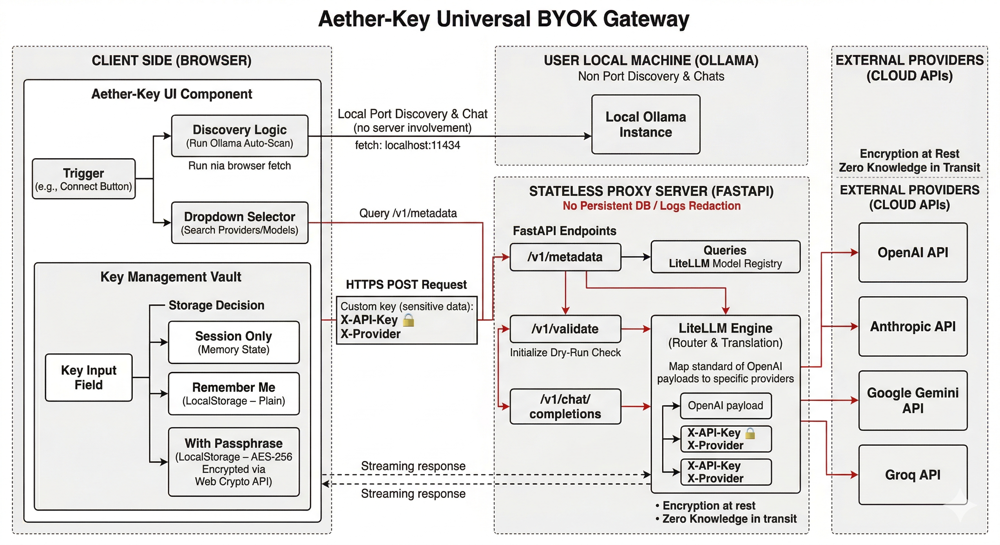

# Aether-Key — Universal BYOK Gateway

Aether-Key is an open-source, two-part system—a drop-in React component and a stateless FastAPI proxy—that allows developers to offload LLM API costs to the end-user. 

It provides a seamless **"Freemium-to-BYOK" (Bring Your Own Key)** bridge, enabling users to use their own API keys for **40+ cloud providers** (OpenAI, Anthropic, Gemini, Groq, etc.) via [LiteLLM](https://github.com/BerriAI/litellm) or securely connect their **local Ollama models** through a hardened, zero-knowledge architecture.

---

## The Problem

Every developer building LLM-powered applications runs into the same three walls:
1. **The Cost Barrier:** You cannot scale agentic AI projects (which consume massive tokens) without burning money or severely limiting usage.
2. **The Provider Lock-in:** It's painful to maintain separate SDKs and boilerplate to support every major foundation model.
3. **The Privacy & Trust Gap:** Users are hesitant to hand off their private API keys to unknown third-party servers.

## The Solution

Aether-Key is your personal OpenRouter, but built to be embedded directly into your application. 

* **Keys are never stored on your server** — absolute zero-knowledge.
* **Users pay with their own keys** — zero inference costs for you.
* **100+ Providers supported** — write code once, run any model.
* **First-class local models** — Ollama auto-discovery hits `localhost:11434` directly from the browser.

---

## Architecture Flow



Aether-Key's proxy acts solely as a transient translator, not a gatekeeper. API keys are injected directly from the user's browser, used for a single request via LiteLLM, and immediately wiped from memory.

---

## Key Features

- 🔍 **Searchable Provider Registry:** Users can search and select from a live list of supported providers and models.
- 📡 **Ollama Auto-Discovery:** Native client-side scanner pings `localhost` to automatically detect locally running models (bypassing the proxy entirely for zero-latency local inference).
- 🛡️ **The Key Vault:** Three zero-knowledge storage tiers for user keys:
  - **Session Only:** Keys kept in memory, cleared on refresh.
  - **Remember Me:** Keys saved to local storage for convenience.
  - **Encrypted Passphrase:** Keys are AES-256 encrypted directly in the browser using the Web Crypto API before being saved.
- ✅ **Real-Time Validation:** 1-token health check verifies user credentials instantly.
- 🚀 **Stream Support:** Full Server-Sent Events (SSE) streaming for typewriter-style output.

---

## Quick Start

Aether-Key is designed for a 10-minute integration into any existing React project.

### 1. Install the Component

```bash
npm install @aether-key/react
```

### 2. Wrap Your App

Place the Context Provider at the root of your application, pointing to your Aether-Key Proxy (see Step 3) and your local Ollama port.

```tsx
import { AetherKeyProvider } from '@aether-key/react';

function Root() {
  return (
    <AetherKeyProvider 
      proxyUrl="http://localhost:8000" 
      ollamaUrl="http://localhost:11434"
    >
      <App />
    </AetherKeyProvider>
  );
}
```

### 3. Build Your UI

Import the Modal to let users connect their AI, and use the `useBYOK` hook to grab the secure headers for your API calls.

```tsx
import { useState } from 'react';
import { AetherKeyModal, useBYOK, ConnectionStatus } from '@aether-key/react';
import '@aether-key/react/dist/index.css';

function ChatBox() {
  const [isOpen, setIsOpen] = useState(false);
  const { proxyUrl, ollamaUrl } = useAetherKeyContext();
  const { headers, isConfigured, provider, model } = useBYOK();
  
  const sendMessage = async (messages) => {
    // 1. Determine destination URL
    const isLocal = provider === 'ollama';
    const targetUrl = isLocal 
      ? `${ollamaUrl}/api/chat` 
      : `${proxyUrl}/v1/chat/completions`;

    // 2. Attach the injected BYOK headers
    const res = await fetch(targetUrl, {
      method: "POST",
      headers: {
        "Content-Type": "application/json",
        ...(isLocal ? {} : headers) // Cloud providers need X-API-Key and X-Provider
      },
      body: JSON.stringify({ model, messages, stream: false })
    });
  }

  return (
    <div>
      <ConnectionStatus />
      <button onClick={() => setIsOpen(true)}>Configure AI</button>
      <AetherKeyModal isOpen={isOpen} onClose={() => setIsOpen(false)} />
    </div>
  )
}
```

### 4. Run the Stateless Proxy

The proxy is required for cloud providers. It requires no database and no persistent storage.

```bash
# Clone the repository
git clone https://github.com/your-username/aether-key.git
cd aether-key/apps/proxy

# Run via Docker (Recommended)
docker compose up --build

# OR run locally via Python
python -m venv venv && source venv/bin/activate
pip install -r requirements.txt
uvicorn app.main:app --port 8000
```

---

## Security & Privacy Protocols

Security is not a feature of Aether-Key—it is the core design constraint.

- **No Persistence Guarantee:** The server strictly forbids database connections or caching layers.
- **Header Injection:** Keys are transmitted in the `X-API-Key` request header rather than the payload body, making them immune to standard body loggers.
- **No-Log Middleware:** A custom FastAPI middleware aggressively scrubs sensitive headers (`X-API-Key`, `Authorization`) before they ever touch the terminal output or log files.
- **Client-Side AES Encryption:** The `passphrase` storage tier encrypts the user's API key natively in the browser via Web Crypto API. The server never sees the raw key until the exact millisecond an inference request requires it.

---

## Tech Stack

| Layer | Technology |
|---|---|
| **Frontend Component** | React 18, TypeScript, Tailwind CSS, Lucide |
| **State & API Sync** | Zustand, TanStack React Query |
| **In-Browser Encryption** | Web Crypto API (AES-256) |
| **Proxy Server** | FastAPI, Uvicorn (Python) |
| **LLM Router** | LiteLLM |
| **Distribution** | NPM (UI), Docker (Proxy) |

## License

MIT
